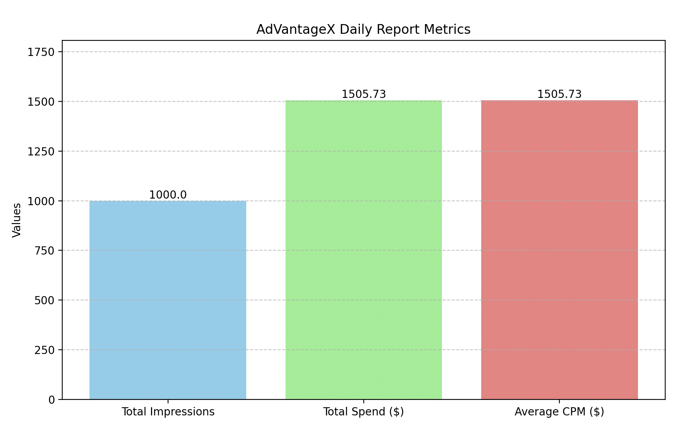

# RTB Practice Simulation

This project contains a Python script that simulates various aspects of Real-Time Bidding (RTB) and OpenRTB processes. It's designed to demonstrate key concepts in programmatic advertising and provide a foundation for understanding the mechanics of ad exchanges.

## Features

- OpenRTB bid request and response simulation
- RTB auction simulation
- Basic bidding strategy implementation
- Bid price adjustment based on user data
- Daily reporting functionality
- Generates a visual daily report summarizing auction performance

## Requirements

- Python 3.6+
- No external libraries required (uses only built-in Python modules)

## Usage

To run the simulation:

```
python rtb_practice.py
```

This will execute all parts of the simulation and print the results to the console.

## Code Structure

- `generate_bid_request()`: Simulates an OpenRTB bid request
- `generate_bid_response()`: Simulates a bid response
- `run_rtb_auction()`: Simulates an RTB auction
- `analyze_auction_results()`: Analyzes the results of multiple auctions
- `run_simulation()`: Runs a full simulation of multiple auctions
- `bidding_strategy()`: Implements a basic bidding strategy
- `adjust_bid_price()`: Adjusts bid prices based on user data
- `generate_daily_report()`: Generates a simple daily report of auction performance

## Extending the Simulation

This simulation can be extended in various ways:

- Implement more sophisticated bidding strategies
- Add more fields to the bid request and response to simulate more complex scenarios
- Implement different auction types (e.g., second-price auctions)
- Add functionality to simulate ad serving and impression tracking

## AdVantageX Daily Report Visualization

This project now includes branding for AdVantageX, our fictional ad exchange, which is reflected in the daily report visualization. This report provides key metrics such as Total Impressions, Total Spend, and Average CPM.




## Disclaimer

This is a simplified simulation for educational purposes and does not represent a complete or production-ready RTB system.
